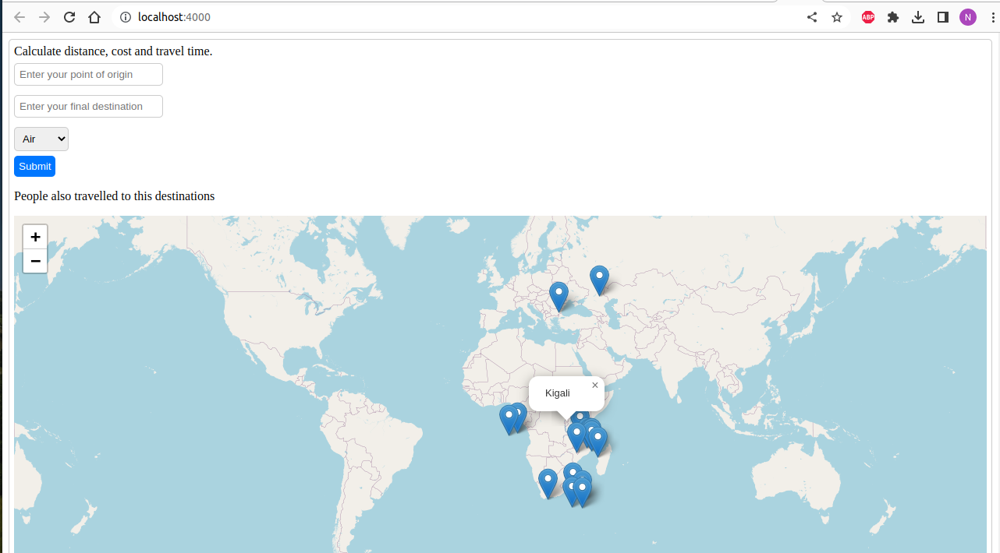

## Introduction
This is a simple tool that facilitates collection of data on travel routes patterns and places. Using this information provided by the user it then calculates approximate travel time, and cost for the user.


## User Stories
1. The user can enter the destination name into an online form
1. The user can enter a place of origin name
1. The user can select the mode of transport
1. The user will get the distance between the two points
1. The user will get the total approximate travel time
1. User can add something interesting to the description of a route
1. User can view places commonly traveled by others on a map
## Requirements
- Ruby 3.0.2
- Rails version: 7.0.4.2
- NodeJS (v16), and npm
- Postgresql
- React-Leaflet

## Setup
If you have latest Ruby and ruby on rails installed and Node run:
```sh
bundle install
rails db:create
rails db:migrate
rails db:seed
npm install --prefix client
```
## Instructions
To set up your backend, run:

```console
$ bundle install
```

You can run the Rails application in one terminal by running:

```console
$ rails s
```

The React application is in the `client` directory. To set it up, from the root directory, run:

```console
$ npm install --prefix client
```
Using `--prefix client` will run the npm command within the `client` directory.

Then, [open another terminal][new terminal] and run React:

```console
$ npm start --prefix client
```
Each application will run on its own port on `localhost`:

- React: [http://localhost:4000]
- Rails: [http://localhost:3000]

# Using Docker Image.
This repository comes with Docker image which you can run without installing the dependencies on your local environment seperately.

Run the Docker image using the docker run command followed by the image name and any additional options or parameters needed. 

Verify that the container is running by checking the output of docker ps. If the container is not running, you can check the logs using the docker logs command followed by the container ID or name.